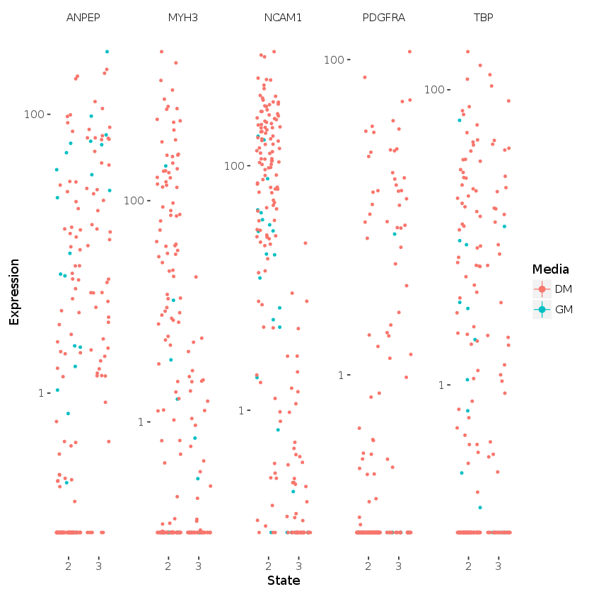

# AJACS京都２ NGSデータから新たな知識を導出するための高次解析 実習資料

[尾崎遼](http://yuifu.github.io) haruka.ozaki@riken.jp
理化学研究所 情報基盤センター バイオインフォマティクス研究開発ユニット 基礎科学特別研究員


----

[統合データベース講習会：AJACS京都２](http://events.biosciencedbc.jp/training/ajacs62) (2016/09/02) における講義「NGSデータから新たな知識を導出するための高次解析」の実習用資料です。

----

## 必要な環境

__Google Chrome (>= 13) のインストールをお願いします__

[Jupyter Notebook](http://jupyter.org/) がサポートするブラウザが必要となります。
※Jupyter Notebookのインストールの必要はありません。

- Chrome >= 13
- ~~Safari >= 5~~
- ~~Firefox >= 6~~

（手順）端末のブラウザが[サポートしていないバージョン](http://jupyter-notebook.readthedocs.io/en/latest/notebook.html#browser-compatibility)の場合は、以下URLにアクセスしダウンロード・インストールします。

- Chrome　https://www.google.com/chrome/browser/desktop/index.html
- ~~Safari　 https://support.apple.com/downloads/safari~~
- ~~Firefox　https://www.mozilla.org/en-US/firefox/new/~~

## jupyterhubのURL
当日までにこちらでアナウンスする予定です。

- Chrome の方は "ADVANCED" をクリックし、"Proceed to <URL> (unsafe)" をクリックしてアクセスしてください


## Monocle による一細胞RNA-Seqデータの擬時間推定

Monocle: http://bioconductor.org/packages/release/bioc/html/monocle.html


```
###################################################
### code chunk number 1: monocle-vignette.Rnw:26-30
###################################################
library(Biobase)
library(knitr)
library(reshape2)
library(ggplot2)

###################################################
### code chunk number 2: init_monocle
###################################################
library(HSMMSingleCell)
library(monocle)
data(HSMM_expr_matrix)
data(HSMM_gene_annotation)
data(HSMM_sample_sheet)
```

```
###################################################
### code chunk number 4: build_cell_data_Set
###################################################
pd <- new("AnnotatedDataFrame", data = HSMM_sample_sheet)
fd <- new("AnnotatedDataFrame", data = HSMM_gene_annotation)
HSMM <- newCellDataSet(as.matrix(HSMM_expr_matrix), phenoData = pd, featureData = fd)

###################################################
### code chunk number 5: detect_genes
###################################################
HSMM <- detectGenes(HSMM, min_expr = 0.1)
print(head(fData(HSMM)))
expressed_genes <- row.names(subset(fData(HSMM), num_cells_expressed >= 50))


###################################################
### code chunk number 6: show_pData
###################################################
print(head(pData(HSMM)))
```

```
###################################################
### code chunk number 8: lognormal_plot
###################################################
# Log-transform each value in the expression matrix.
L <- log(exprs(HSMM[expressed_genes,]))

# Standardize each gene, so that they are all on the same scale,
# Then melt the data with plyr so we can plot it easily"
melted_dens_df <- melt(t(scale(t(L))))

# Plot the distribution of the standardized gene expression values.
qplot(value, geom="density", data=melted_dens_df) +  stat_function(fun = dnorm, size=0.5, color='red') + 
xlab("Standardized log(FPKM)") +
ylab("Density")
```


```
###################################################
### code chunk number 9: select_genes
###################################################
marker_genes <- row.names(subset(fData(HSMM), 
                                 gene_short_name %in% c("MEF2C", "MEF2D", "MYF5", "ANPEP", "PDGFRA",
                                                        "MYOG", "TPM1", "TPM2", "MYH2", "MYH3", "NCAM1", "TNNT1", "TNNT2", "TNNC1",
                                                        "CDK1", "CDK2", "CCNB1", "CCNB2", "CCND1", "CCNA1", "ID1")))


###################################################
### code chunk number 10: basic_diff
###################################################
diff_test_res <- differentialGeneTest(HSMM[marker_genes,], 
                                      fullModelFormulaStr="expression~Media")

# Select genes that are significant at an FDR < 10%
sig_genes <- subset(diff_test_res, qval < 0.1)

# Attach the HUGO symbols and other featureData for these genes
sig_genes <- merge(fData(HSMM), sig_genes, by="row.names")
sig_genes[,c("gene_short_name", "pval", "qval")]
```

```
###################################################
### code chunk number 11: plot_myog_jitter
###################################################
MYOG_ID1 <- HSMM[row.names(subset(fData(HSMM), 
                                 gene_short_name %in% c("MYOG", "ID1"))),]
plot_genes_jitter(MYOG_ID1, grouping="Media", ncol=2)
```


```
###################################################
### code chunk number 13: select_ordering_cells
###################################################
ordering_genes <- row.names (subset(diff_test_res, qval < 0.1))

#Only use genes are detectably expressed in a sufficient number of cells
ordering_genes <- intersect(ordering_genes, expressed_genes)


###################################################
### code chunk number 14: set_ordering_filter
###################################################
HSMM <- setOrderingFilter(HSMM, ordering_genes)


###################################################
### code chunk number 15: reduce_dimension
###################################################
HSMM <- reduceDimension(HSMM, use_irlba=FALSE)


###################################################
### code chunk number 16: order_cells
###################################################
HSMM <- orderCells(HSMM, num_paths=2, reverse=TRUE)
```

```
###################################################
### code chunk number 17: plot_ordering_mst
###################################################
plot_spanning_tree(HSMM)
```


```
###################################################
### code chunk number 18: plot_markers
###################################################
HSMM_filtered <- HSMM[expressed_genes, pData(HSMM)$State != 3]

my_genes <- row.names(subset(fData(HSMM_filtered), 
                             gene_short_name %in% c("CDK1", "MEF2C", "MYH3"))) 

cds_subset <- HSMM_filtered[my_genes,]
plot_genes_in_pseudotime(cds_subset, color_by="Hours")
```


```
###################################################
### code chunk number 19: setup_test_genes
###################################################
to_be_tested <- row.names(subset(fData(HSMM), 
                             gene_short_name %in% c("TBP", "MYH3", "NCAM1", "PDGFRA", "ANPEP"))) 
cds_subset <- HSMM[to_be_tested, pData(HSMM)$State != 1]


###################################################
### code chunk number 20: all_in_one_test
###################################################
diff_test_res <- differentialGeneTest(cds_subset, fullModelFormulaStr="expression~State")
diff_test_res <- merge(fData(HSMM), diff_test_res, by="row.names")
diff_test_res[,c("gene_short_name", "pval", "qval")]


###################################################
### code chunk number 21: jitter_plot_diff_res
###################################################
plot_genes_jitter(cds_subset, color_by="Media", nrow=1, ncol=NULL, plot_trend=TRUE)
```



```
###################################################
### code chunk number 23: setup_test_genes_pt
###################################################
to_be_tested <- row.names(subset(fData(HSMM), 
                             gene_short_name %in% c("MYH3", "MEF2C", "CCNB2", "TNNT1"))) 
cds_subset <- HSMM[to_be_tested, pData(HSMM)$State != 3]


###################################################
### code chunk number 24: piecewise_test_pt
###################################################
diff_test_res <- differentialGeneTest(cds_subset,  fullModelFormulaStr="expression~sm.ns(Pseudotime)")


###################################################
### code chunk number 25: all_in_one_test_pt
###################################################
diff_test_res <- merge(fData(HSMM), diff_test_res, by="row.names")
diff_test_res[,c("gene_short_name", "pval", "qval")]


###################################################
### code chunk number 26: plot_diff_res_pt
###################################################
plot_genes_in_pseudotime(cds_subset, color_by="Hours")
```


```
###################################################
### code chunk number 27: plot_diff_res_multi
###################################################
to_be_tested <- row.names(subset(fData(HSMM), 
                             gene_short_name %in% c("MT2A", "REXO2", "HDAC4"))) 
cds_subset <- HSMM[to_be_tested, pData(HSMM)$Media == "DM" & pData(HSMM)$State != 1]

diff_test_res <- differentialGeneTest(cds_subset,  
                                      fullModelFormulaStr="expression~State * Hours", 
                                      reducedModelFormulaStr="expression~Hours")
diff_test_res <- merge(fData(cds_subset), diff_test_res, by="row.names")
diff_test_res[,c("gene_short_name", "pval", "qval")]
plot_genes_jitter(cds_subset, grouping="Hours", color_by="State", plot_trend=TRUE) + facet_wrap( ~ feature_label, scales="free_y")
```


```
###################################################
### code chunk number 28: fit_full_model_for_cluster
###################################################
sampled_gene_cds <- HSMM_filtered[sample(nrow(fData(HSMM_filtered)), 100),]
full_model_fits <- fitModel(sampled_gene_cds,  modelFormulaStr="expression~sm.ns(Pseudotime, df=3)")


###################################################
### code chunk number 29: extract_response_curve
###################################################
expression_curve_matrix <- responseMatrix(full_model_fits)
dim(expression_curve_matrix)


###################################################
### code chunk number 30: cluster_and_plot
###################################################
clusters <- clusterGenes(expression_curve_matrix, k=4)
plot_clusters(HSMM_filtered[ordering_genes,], clusters)
```


```
###################################################
### code chunk number 31: citation
###################################################
citation("monocle")


###################################################
### code chunk number 32: sessionInfo
###################################################
sessionInfo()

```
